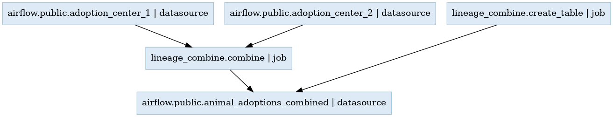
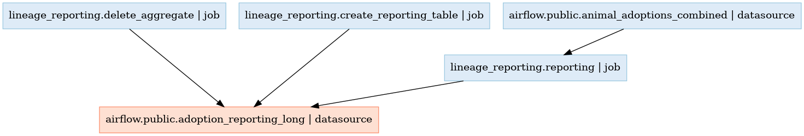

# OpenLineage Event Processor
A `backend` that listens to OpenLineage events and constructs lineage graph for Airflow DAGs.

## Rollout Requirements

* [GoLang](https://go.dev/)
* [OpenLineage Proxy](https://github.com/OpenLineage/OpenLineage/tree/main/proxy/backend#openlineage-proxy-backend)
* [Airflow with OpenLineage Installed - Sample Docker with DAGS](https://github.com/jainnidhi703/airflow-ol)

## Running the Web Server

To build the entire project and run:

Local:
```bash
$ go run cmd/ol-processor/main.go 
```

Docker:
```bash
$ docker-compose up --build
```
> **Note:** Add the configuration settings in `proxy.yml` of OpenLineage Proxy Server. Add OpenLineage proxy Server ports and HTTP forwarding URL to the Go web service.
```bash
server:
  applicationConnectors:
    - type: http
      port: ${OPENLINEAGE_PROXY_PORT:-4433}
  adminConnectors:
    - type: http
      port: ${OPENLINEAGE_PROXY_ADMIN_PORT:-4434}

logging:
  level: ${LOG_LEVEL:-INFO}
  appenders:
    - type: console

proxy:
  source: openLineageProxyBackend
  streams:
    - type: Console
    - type: Http
      url: http://localhost:3000/api/v1/lineage
```


## Approach

* Start an Airflow Openlineage instance, using [Airflow with OpenLineage Installed](https://github.com/jainnidhi703/airflow-ol).
* Once the events start emitting, forward them to [OpenLineage Proxy](https://github.com/OpenLineage/OpenLineage/tree/main/proxy/backend#openlineage-proxy-backend). OpenLineage proxy has 3 default output modes: console, HTTP, and Kafka. In the current approach, we are directly forwarding it through the HTTP mode, using a POST request to `http://localhost:3000/api/v1/lineage` with the Lineage event body. We could have also published them to Kafka and then consumed them from Kafka asynchronously. Also in the case of Kafka, we can start reading events from the previous offset which were not consumed. But the current web server will only start processing Lineage events from the time instance the web server was started.
NOTE: Define the proxy.yml as mentioned above configuration for OpenLineage.
* All the events from post requests are aggregated in a [Graph](https://github.com/dominikbraun/graph) format, building edges between every `input data source -> job` and `job -> output data source`. One graph is built per DAG and all the DAG names and graphs are cached in memory, in a Map. We can use a graph DB as well to store the graph for more query flexibility. Graph DB would allow querying by vertices, making it simpler to query by a job or dataset name.
* In the Go web service the graph for a particular DAG can be queried via the URL: `/api/get/graph/:dag`. If the dag name provided is not available in the cache, then the API would respond 400 with ERROR: `Invalid Dag Name`. If the DAG name is valid/available in the cache, then it will respond PNG Image of the Graph. Each Graph node consists of the datasource/job name and the type i.e. datasource or job
* The Lineage graph for lineage_combine from the sample dags looks as follows:
  
* The Lineage graph for lineage_reporting from the sample dags looks as follows, the adoption_reporting_long datasource is in red because it was deleted in the last job:
  

## Challenges

* Integrating all the components was complex because they were all black boxes, and the reliability of each system affected the overall system.
* Integrating Airflow and OpenLineage was tricky, especially installing the dependencies and setting up the environment paths. Debugging to check if the lineage events were being emitted was also difficult. It wasn't clear whether Airflow-OpenLineage could be directly integrated with other backends or Kafka without using the OpenLineage Proxy.
* Due to the scale and real-time nature of the events, pre-aggregating them in Kafka or another layer could optimize the web server.
* Building and maintaining the state of DAG graphs was also challenging because a data source could be part of multiple graphs. Currently, each DAG has its graph, but when querying by data source, the graph has multiple DAGs attached. Additionally, the graph can have a huge number of input and output datasources, and maintaining the state of both data sources and jobs is a complex problem.


----


